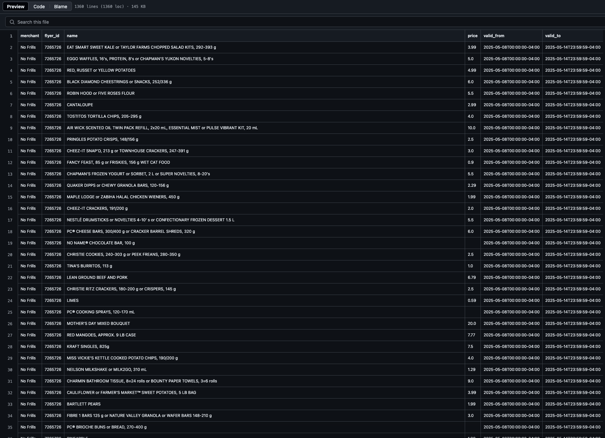

# Flipp Scraper

A Python script to scrape grocery flyer deals from Flipp. This project collects current deals from major grocery stores including No Frills, FreshCo, Walmart, and Loblaws.

## Features

- Scrapes current flyer deals from multiple grocery stores
- Filters for grocery-specific flyers
- Exports data to CSV format
- Handles multiple categories and store types
- Includes deal validity dates


## Prerequisites

- Python 3.9 or higher
- pip (Python package installer)

## Installation

1. Clone the repository:
```bash
git clone https://github.com/Kiizon/flippscrape.git
cd flippscrape
```

2. Create and activate a virtual environment:
```bash
python -m venv .venv
source .venv/bin/activate  # On Windows, use: .venv\Scripts\activate
```

3. Install required packages:
```bash
pip install requests pandas
```

## Usage

1. Run the script:
```bash
python app.py
```

2. Enter your postal code when prompted (format: A1A1A1)

3. The script will:
   - Fetch current flyer data for your postal code
   - Filter for grocery store flyers
   - Extract deal information
   - Save results to `flyer_items_[POSTAL_CODE].csv`

## Output

The script generates a CSV file with the following columns:
- merchant: Store name
- flyer_id: Unique identifier for the flyer
- name: Item name
- price: Item price
- valid_from: Deal start date
- valid_to: Deal end date

### Sample Output


## How It Works

1. **Flyer Collection**:
   - Generates a session ID for API access
   - Fetches flyer data for the specified postal code
   - Filters for grocery store flyers

2. **Data Processing**:
   - Extracts relevant deal information
   - Handles multiple categories
   - Associates items with their respective stores

3. **Data Export**:
   - Formats data into a structured CSV
   - Includes all relevant deal information
   - Maintains store and validity information

## Configuration

The script uses the following default settings:
- Supported stores: No Frills, FreshCo, Walmart, Loblaws

To modify these settings, edit the relevant variables in `app.py`.

Note that some stores have duplicate flyers, each has its own category.
Sometimes two flyers share the same category like Groceries so you'll have to 
find a way to differenciate which one to parse .

## Contributing

Feel free to submit issues and enhancement requests!

## Disclaimer

This project is for educational purposes only. Please note:
- This is an unofficial tool and is not affiliated with Flipp
- Use responsibly and respect Flipp's terms of service
- Consider rate limiting and server load when using the script
- The data is owned by Flipp and their partners
